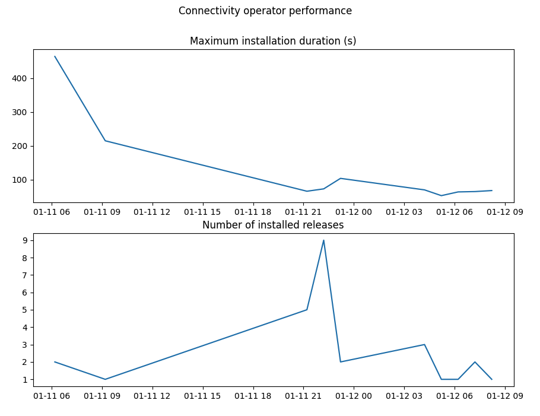

# Description

The light utility checks all SymConnectivity resources of the K8s cluster currently in context. It then plots a graph of the maximum time that the connectivity operator took for each time span. By default the time span is 1 hour.

## Requirements

Python 3.10
Pipenv

## Usage

```
pipenv install
pipenv run python display_connectivity_op_perf.py
```

## Example


